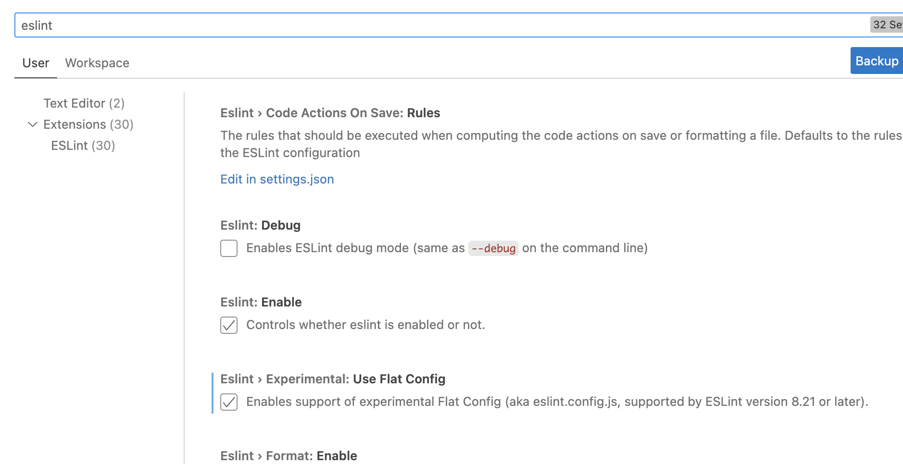

# Contributing to Markdown Viewer

Notes:

- Markdown Viewer is referred to as "the tool" below.
- The project maintainer is referred to as "the author" below

## Bugs and feature requests

If the tool does not behave as expected in any way or you miss some feature, you may want to [report an issue](https://github.com/c3er/mdview/issues/new/choose). When reporting ensure following points:

- Do you have [the latest version](https://github.com/c3er/mdview/releases/latest)?
- Is the issue [already reported](https://github.com/c3er/mdview/issues?q=)?
    - If an issue exists and is still open, you may give it a thumbs up reaction as signal to the tool author.
    - A closed issue may be closed, because a bug is fixed only seemingly or the author did not consider the reported behavior or missing feature as to be fixed
        - **Seemingly fixed bug:** feel free to reopen the issue and provide additional information (see below)
        - **Issues not considered to be fixed:** you may provide some additional arguments, why the author was wrong at not fixing this issue🙂
- The issue provides all needed information (see below)

### Needed information

For missing features and "strange behavior", the author needs a good description of the expected behavior.

For things like exception messages, application crashes or non working menu points, following information is helpful:

- Exact steps to reproduce the bug
- Operating system
    - For Windows, the version should be sufficient, e.g. "20H2". If you are not sure, which exact version you have, press the key combination `Win+R` and type `winver`.
    - On Linux just all the information about your environment that may be appropriate🙂

## Code contribution

If you like to add some feature or fix an apparent bug, it is recommended to open an issue explaining the change first. This makes it possible to discuss the feature or bug fix first and makes sure that you don't put to much work in the case that the author does not want that particular change to his tool.

Though, in some cases, like fixing a typo, it may be easier to just open a pull request directly. Opening an issue first is just a recommendation.

Use GitHub's [pull request mechanism](https://github.com/c3er/mdview/compare) to propose your contribution.

Please ensure following points:

- All automated tests pass by running `npm run test-all`
    - If a test fails after a fresh clone/checkout on your machine (i.e. without any changes by you), it is very clearly a bug and and an issue with all needed information about your environment would be very appreciated.
- The code is formatted properly by running `npm run fix`
- Your changes do not have any merge conflicts with the current state of the master branch
- For your convenience it is recommended that you make your changes not on the master branch but on an extra feature branch

### Development environment

#### Requirements

The tool is developed and tested locally under Windows and macOS. Both at the current version. The continuous integration uses the latest Ubuntu version as provided by GitHub.

A [local Git installation](https://git-scm.com/) is needed. For Windows, there is a GUI named [Git Extensions](https://gitextensions.github.io/).

[Node.js](https://nodejs.org/en/) including the NPM package manager is needed. If your Node.js version is too old, the unit tests and some other scripts may fail because of syntax errors. On a Linux machine you can [use NVM](https://www.freecodecamp.org/news/how-to-install-node-js-on-ubuntu-and-update-npm-to-the-latest-version/) to install the latest LTS version.

After cloning the Git repository, type `npm install`. NPM may put some warnings while installing the packages.

#### Recommendations

The author uses [Visual Studio Code](https://code.visualstudio.com/) as editor. Some plugins are helpful for this project:

- [EditorConfig](https://marketplace.visualstudio.com/items?itemName=EditorConfig.EditorConfig)
- [ESLint](https://marketplace.visualstudio.com/items?itemName=dbaeumer.vscode-eslint): Currently, a flag has to be set for support of the new ESLint configuration file format:
  
- [Prettier](https://marketplace.visualstudio.com/items?itemName=esbenp.prettier-vscode): Some fine tuning in the settings may be required. Also, it is recommended to use Prettier as VS Code's formatter and enable automatic formatting at saving.

The icon is made with help of [Inkscape](https://inkscape.org/en/) and [ImageMagick](https://www.imagemagick.org). While the application icon does not look too bad, a proper icon for Markdown *documents* is missing yet.

#### Commands

##### `npm start`

Starts a new instance for development.

`npm start path/to/file.md` starts an instance with the given file open.

##### Testing

`npm test` runs the unit tests.

`npm run test-int` runs unit and integration tests.

`npm run lint` checks the code style.

`npm run test-all` does linting and runs all tests.

`npm run fix` fixes linting (style) issues that can be fixed automatically.

##### `npm run dist`

Builds the setup packages for the current operating system, plus some additional files. Windows, macOS and Linux are supported.

### Debugging

Main and renderer processes have to be debugged independently of each other.

#### Main process

The main process can be debugged with [Visual Studio Code](https://code.visualstudio.com/). A `launch.json` is in the repository.

#### Renderer process

The renderer process (`index.html` and `index.js`) must be debugged with help of the Electron development tools by calling in the main menu "Tools" -> "Developer tools" or by pressing the F10 key.

#### Tests

For debugging the currently opened test spec file is a configuration provided for VS Code's `launch.json`.

The integration tests cannot be debugged currently, i.e. one can only work with `console.log` statements.

### Troubleshooting

You may encounter some issue when trying to build the Electron distribution i.e. the build may (partially) fail. A possible fix is described here [not able to build installer/uninstaller (ERR_ELECTRON_BUILDER_CANNOT_EXECUTE)](doc/development-build-installer-issue.md)

See [section Startup speed in the README](README.md#startup-speed) for known delays under Windows. If you observe a big delay at application startup, you should add the  development path of the application to your virus scanner exclusion list. This workaround may also help with other Electron applications.
