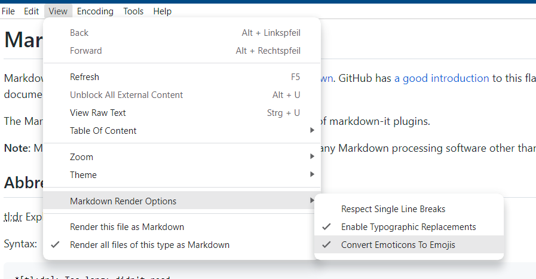

# Markdown Viewer's Flavor

Markdown Viewer orients its rendering in [GitHub Flavored Markdown](https://github.github.com/gfm/). GitHub has [a good introduction](https://docs.github.com/en/get-started/writing-on-github/getting-started-with-writing-and-formatting-on-github) to this flavor and Markdown in general. This document describes only extensions specific to Markdown Viewer.

The Markdown rendering is based on [markdown-it](https://github.com/markdown-it/markdown-it) and a number of markdown-it plugins.

**Note:** Many examples will not be displayed properly on GitHub or any Markdown processing software other than Markdown Viewer.

## Abbreviations

tl;dr Explain abbreviations on mouse over on them.

*[tl;dr]: Too long; didn't read

Syntax:

```
*[tl;dr]: Too long; didn't read
```

## Containers

You can put text in certain containers that have a certain background color each.

::: info
This is an info.
:::

::: warning
This is a warning.
:::

::: error
This is an error.
:::

Syntax:

```
::: info
This is an info.
:::

::: warning
This is a warning.
:::

::: error
This is an error.
:::
```

## Emojis

Since Markdown Viewer supports UTF-8, you can naturally use emoji characters.👍 But by default, emoticons are also interpreted and displayed as emojis:

- :)
- 8-)

If these emoticons above are displayed as ASCII characters, the interpretation of emoticons may be deactivated. Activate (or deactivate) this feature via:

View / Markdown Render Options / Convert Emoticons To Emojis



Actual emoticons:

```
- :)
- 8-)
```

## Footnotes

See at the bottom of the document to see the footnote.^[The note to the footnotes example]

There are multiple ways to define footnotes:

- Reference with number:
  ```
  Footnote reference with number.[^1]

  [^1]: The numbered footnote
  ```
- Reference with name:
  ```
  Footnote reference with name.[^my-footnote]

  [^my-footnote]: The named footnote
  ```
- Inline:
  ```
  An inline footnote.^[This is the inline footnote]
  ```

Note: the referenced footnotes can be defined anywhere in the document.

## Embedding audio and video files

It is possible to embed audio and video files directly into the document to be able to directly play them.

Audio:


Video:


Audio and video files are from https://samplelib.com/

In both cases, use the syntax for images.

```

```

## Marking text

You can mark the text, i.e. ==displaying the text with yellow background==

Syntax:

```
You can mark the text, i.e. ==displaying the text with yellow background==
```

## Extended table syntax

Additionally to the [basic GFM table syntax](https://docs.github.com/en/get-started/writing-on-github/getting-started-with-writing-and-formatting-on-github/quickstart-for-writing-on-github#example-of-a-table), Markdown Viewer supports an extended syntax -- see [project page of markdown-it-multimd-table](https://github.com/redbug312/markdown-it-multimd-table) for more information.

### Colspan

|              |          Grouping           ||
| First Header | Second Header | Third Header |
| ------------ | ------------- | ------------ |
| Content      | Long Cell                   ||
| Content      | Cell          | Cell         |

Syntax:

```
|              |          Grouping           ||
| First Header | Second Header | Third Header |
| ------------ | ------------- | ------------ |
| Content      | Long Cell                   ||
| Content      | Cell          | Cell         |
```

### Rowspan

| Col 1        | Col 2        |
| ------------ | ------------ |
| Row 1, col 1 | Row 1, col 2 |
| ^^           | Row 2, col 2 |

Syntax:

```
| Col 1        | Col 2        |
| ------------ | ------------ |
| Row 1, col 1 | Row 1, col 2 |
| ^^           | Row 2, col 2 |
```

### Multiple lines in a row

| Markdown    | Rendered HTML |
| ----------- | ------------- |
| `Content`   | Content       |
|    - Item 1 | - Item 1      | \
|    - Item 2 | - Item 2      |

Syntax:

```
| Markdown    | Rendered HTML |
| ----------- | ------------- |
| `Content`   | Content       |
|    - Item 1 | - Item 1      | \
|    - Item 2 | - Item 2      |
```

### Headerless

| ---- | ---- |
| Cell | Cell |
| Cell | Cell |

Syntax:

```
| ---- | ---- |
| Cell | Cell |
| Cell | Cell |
```

## LaTeX math

Rendering math formulas, given in LaTeX format is supported. The LaTeX code for math formulas can span a single line or multiple lines.

### Single line:

$\sqrt{3x-1}+(1+x)^2$

Syntax:

```latex
$\sqrt{3x-1}+(1+x)^2$
```

### Multiple lines

$$\begin{array}{c}

\nabla \times \vec{\mathbf{B}} -\, \frac1c\, \frac{\partial\vec{\mathbf{E}}}{\partial t} &
= \frac{4\pi}{c}\vec{\mathbf{j}}    \nabla \cdot \vec{\mathbf{E}} & = 4 \pi \rho \\

\nabla \times \vec{\mathbf{E}}\, +\, \frac1c\, \frac{\partial\vec{\mathbf{B}}}{\partial t} & = \vec{\mathbf{0}} \\

\nabla \cdot \vec{\mathbf{B}} & = 0

\end{array}$$

Syntax:

```latex
$$\begin{array}{c}

\nabla \times \vec{\mathbf{B}} -\, \frac1c\, \frac{\partial\vec{\mathbf{E}}}{\partial t} &
= \frac{4\pi}{c}\vec{\mathbf{j}}    \nabla \cdot \vec{\mathbf{E}} & = 4 \pi \rho \\

\nabla \times \vec{\mathbf{E}}\, +\, \frac1c\, \frac{\partial\vec{\mathbf{B}}}{\partial t} & = \vec{\mathbf{0}} \\

\nabla \cdot \vec{\mathbf{B}} & = 0

\end{array}$$
```

## Subscript and superscript

- Subscript: H~2~0, CO~2~
- Superscript: 29^th^, e^x^

Syntax:

```
- Subscript: H~2~0, CO~2~
- Superscript: 29^th^, e^x^
```

## Task lists

- [ ] Unchecked
- [x] Checked

Syntax:

```
- [ ] Unchecked
- [x] Checked
```

## Mermaid diagrams

Diagrams can be created with help of [Mermaid](https://mermaid.js.org/) like this:

```mermaid
graph TD
    A[Christmas] -->|Get money| B(Go shopping)
    B --> C{Let me think}
    C -->|One| D[Laptop]
    C -->|Two| E[iPhone]
    C -->|Three| F[Car]
```

Syntax:

````
```mermaid
graph TD
    A[Christmas] -->|Get money| B(Go shopping)
    B --> C{Let me think}
    C -->|One| D[Laptop]
    C -->|Two| E[iPhone]
    C -->|Three| F[Car]
```
````

See the [Mermaid documentation](https://mermaid.js.org/intro/) for the syntax and possibilities offered.
